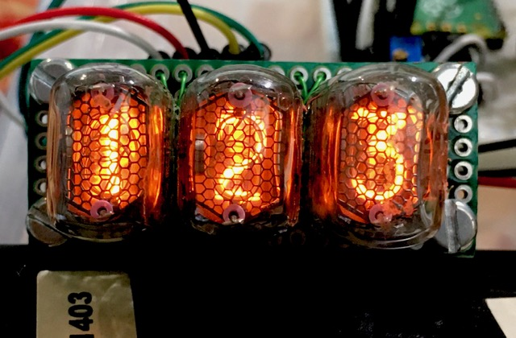
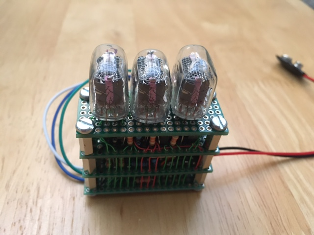

****Work In Progress.****

      

# 3 Digit Nixie Display #

  * Nixie = 1n-17
  * Target CPU = PIC 16F1509
  * 3v/5v SPI interface
  * Internal 170 volt SMPU
  * Neat maths routine for 16 bit x 8  bit divide

